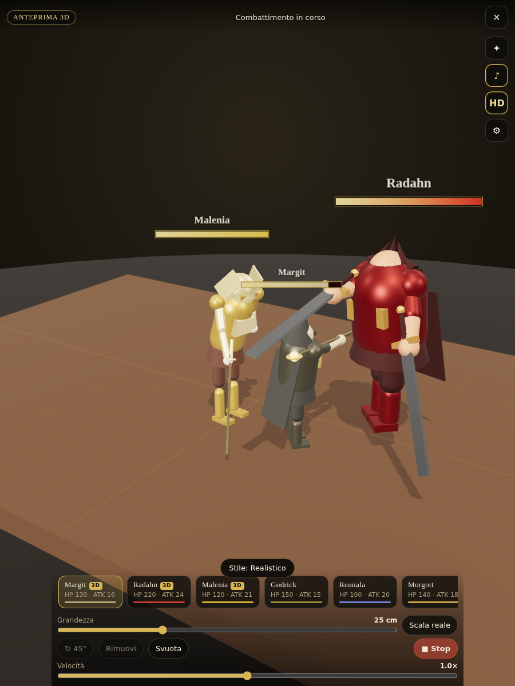

# Elden Hologram AR

Evoca i boss di Elden Ring come **ologrammi in alta definizione sul tavolo di casa**, guardandoli
attraverso la fotocamera del telefono. Scegli tu quanto sono grandi (da 5 cm a "scala reale") e
falli **combattere fra loro**. Web app, niente da installare: si apre da un link HTTPS.

<p align="center"></p>

> **Malenia, Radahn e Margit sono già modelli 3D veri** generati da immagini di riferimento:
> l'app li scarica da sola al primo utilizzo. Gli altri boss usano segnaposto procedurali,
> con i prompt pronti in [`prompts/`](./prompts/) per generarli allo stesso modo.

## Cosa fa

- **AR vera (WebXR, Android + Chrome):** rileva il tavolo, mostra un sigillo dorato dove appoggiare il
  boss, ombre di contatto, stima della luce reale, DOM overlay per i controlli.
- **Modalità Camera (iPhone e tutto il resto):** fotocamera + giroscopio, i boss sono ancorati a un
  piano virtuale davanti a te. Regoli l'altezza del telefono dal tavolo e il campo visivo per far
  coincidere il virtuale con il reale. Su iOS c'è anche **Quick Look** (AR nativa Apple) se aggiungi i file USDZ.
- **Anteprima 3D (desktop):** tavolo virtuale con orbit camera, per provare tutto senza telefono.
- **Grandezza libera:** slider logaritmico 5 cm → 10 m, pizzico a due dita, pulsante **Scala reale**
  (altezza da lore: Malenia 2,6 m, Radahn 6,5 m, Gigante di Fuoco 28 m…).
- **Combattimento:** tutti contro tutti. Ogni boss cerca il nemico più vicino, si avvicina, attacca
  con tempi di impatto per clip, subisce contraccolpi, muore e si dissolve; barre vita, scintille,
  suoni sintetizzati, banner del vincitore, rivincita, slow-motion (0,1× → 2×).
- **Stili:** *Realistico* (PBR, ambiente HDR, tone mapping ACES), *Spirito* (ologramma azzurro come le
  Ceneri spirituali), *Oro ancestrale*. Evocazione con effetto "materializzazione" dal basso.
- **HD:** supersampling WebXR 1,4×, pixel ratio 2, texture anisotrope, ombre PCF 2048, supporto GLB
  con Draco / Meshopt / KTX2 / WebP.
- **13 boss** con statistiche e altezze da lore: tre con modello 3D reale (Malenia, Radahn,
  Margit), gli altri con segnaposto procedurali animati, sostituibili con i tuoi GLB.
- **Modelli senza scheletro supportati**: chi non ha un rig viene animato a corpo rigido, così
  anche un modello generato da una foto combatte senza altro lavoro.

## Avvio rapido

```bash
cd elden-hologram-ar
npm install          # copia anche i decoder Draco/Basis in public/decoders
npm run dev          # server HTTPS in LAN (certificato self-signed)
```

Apri sul telefono l'indirizzo `https://<ip-del-pc>:5173` mostrato in console, accetta il certificato,
poi **Avvia AR** (Android/Chrome) o **Modalità Camera** (iPhone). Sul PC usa **Anteprima 3D**.

Build e test:

```bash
npm run build        # dist/ pronto per GitHub Pages / qualsiasi hosting statico HTTPS
npm test             # smoke test headless: evoca, combatte, verifica il vincitore (screenshot in tests/output/)
```

### Deploy su GitHub Pages

Il workflow [`.github/workflows/deploy-pages.yml`](../.github/workflows/deploy-pages.yml) pubblica la
cartella `dist/` a ogni push su `main`. Nel repository: *Settings → Pages → Source: GitHub Actions*.
L'URL sarà `https://<utente>.github.io/Code/` (HTTPS incluso: WebXR e fotocamera funzionano).

## Come si usa (sul telefono)

1. Scegli il boss nella barra in basso.
2. **Tocca il tavolo** dove vuoi evocarlo (in WebXR aspetta che appaia il sigillo dorato).
3. **Pizzica** per ridimensionare, **trascina** per spostare, **due dita** per ruotare, oppure usa lo slider
   e i pulsanti *↻ 45°*, *Scala reale*, *Rimuovi*.
4. Evoca almeno due boss e premi **⚔ Combatti**. Regola la **Velocità** per lo slow-motion.
5. **✦** cambia stile (realistico / spirito / oro), **♪** suoni, **HD** qualità, **⚙** impostazioni.

Per registrare il combattimento usa la registrazione schermo del telefono (in WebXR la fotocamera
è composta dal sistema e non è accessibile alla pagina).

## Boss reali già inclusi

Tre boss sono **modelli 3D veri**, generati con la pipeline immagine → 3D e caricati
automaticamente dall'app (nessuna installazione, si scaricano al volo dal CDN):

| Boss | Pipeline | Triangoli |
| --- | --- | --- |
| Malenia | immagine di riferimento (GPT Image) → Tripo H3.1 *image-to-3D* | ~57.000 |
| Radahn | immagine di riferimento (GPT Image) → Tripo H3.1 *image-to-3D* | ~57.000 |
| Margit | Tripo *text-to-3D* | ~60.000 |

Sono mesh texturizzate **senza scheletro**: l'app le anima a **corpo rigido** (respiro, passo
ondeggiante, affondo, spazzata rotante, contraccolpo, caduta all'indietro), quindi combattono
regolarmente. Gli altri boss usano i segnaposto procedurali finché non generi i loro modelli.

Per tenerli in locale (offline, niente CDN):

```bash
npm run fetch-models     # scarica in public/models/ e aggiorna il manifest
```

## Aggiungere gli altri boss: la pipeline

Per gli altri dieci boss del manifest:

1. Apri [`prompts/README.md`](./prompts/README.md) e il pacchetto prompt del boss in
   [`prompts/bosses/`](./prompts/bosses/) (text-to-3D, character sheet per image-to-3D, retexture,
   animazioni, snippet manifest).
2. Genera il modello (Meshy, Tripo, Rodin, Hunyuan3D…), riggalo e scarica le animazioni
   (Meshy/Tripo Animate o Mixamo).
3. Unisci tutto in un GLB con [`tools/blender_export.py`](./tools/blender_export.py), comprimi con
   `npm run optimize -- file.glb`, aggiorna il manifest con `npm run manifest`.
4. Metti il file in `public/models/<id>.glb`: l'app lo carica automaticamente.

Requisiti del GLB: un personaggio, piedi a y=0, fronte verso +Z, riggato, clip `Idle`, `Walk`,
`Attack1`, `Attack2`, `Hit`, `Death` (nomi alternativi riconosciuti in automatico). L'altezza viene
normalizzata a runtime, quindi la scala del file non importa.

## Struttura

```
elden-hologram-ar/
├── index.html, src/style.css      UI (italiano), schermata iniziale, HUD / DOM overlay
├── src/main.js                    bootstrap + API di debug window.__elden
├── src/app/App.js                 renderer, luci/ombre, evocazione, gesti, effetti, loop
├── src/app/Modes.js               WebXRMode · GyroCameraMode · PreviewMode
├── src/bosses/Boss.js             entità boss: normalizzazione, animazioni, stile, HP, evocazione/dissolvenza
├── src/bosses/BossLoader.js       manifest + GLTF (Draco/KTX2/Meshopt) con fallback procedurale
├── src/bosses/ProceduralBoss.js   segnaposto animati costruiti con primitive
├── src/fight/FightSystem.js       IA di combattimento tutti-contro-tutti
├── src/fx/                        shader ologramma, particelle, barre HP, suoni WebAudio
├── src/input/Gestures.js          tap / drag / pinch / rotazione (Pointer Events)
├── public/bosses.json             manifest dei boss (stat, altezze da lore, clip, segnaposto)
├── public/models/, public/usdz/   i tuoi asset HD (ignorati da git)
├── prompts/                       prompt pack per generare i boss con l'IA
├── tools/                         ottimizzazione GLB, manifest, script Blender
└── tests/smoke.mjs                smoke test Playwright headless
```

## Requisiti e limiti

| Piattaforma | Modalità | Note |
| --- | --- | --- |
| Android + Chrome (dispositivo con ARCore) | **Avvia AR** (WebXR) | tracciamento 6DoF delle superfici, ombre sul tavolo, stima luce |
| iPhone / iPad (Safari) | **Modalità Camera** | Safari iOS non supporta WebXR AR: il piano è virtuale, il telefono va tenuto fermo per il massimo realismo. Quick Look opzionale con USDZ (un boss alla volta). |
| Desktop | **Anteprima 3D** | orbit camera, tavolo virtuale |

- Serve **HTTPS** (WebXR, fotocamera, sensori). `npm run dev` lo fornisce in LAN.
- I nomi e i design dei boss sono di FromSoftware / Bandai Namco: progetto fan-made per uso personale,
  nessun asset del gioco incluso o redistribuibile.

## Roadmap

Vedi [`FASI.md`](./FASI.md): stato delle fasi completate e prossimi passi (occlusione con depth
sensing, modalità marker per iOS a 6DoF, multiplayer locale, registrazione video in-app).
