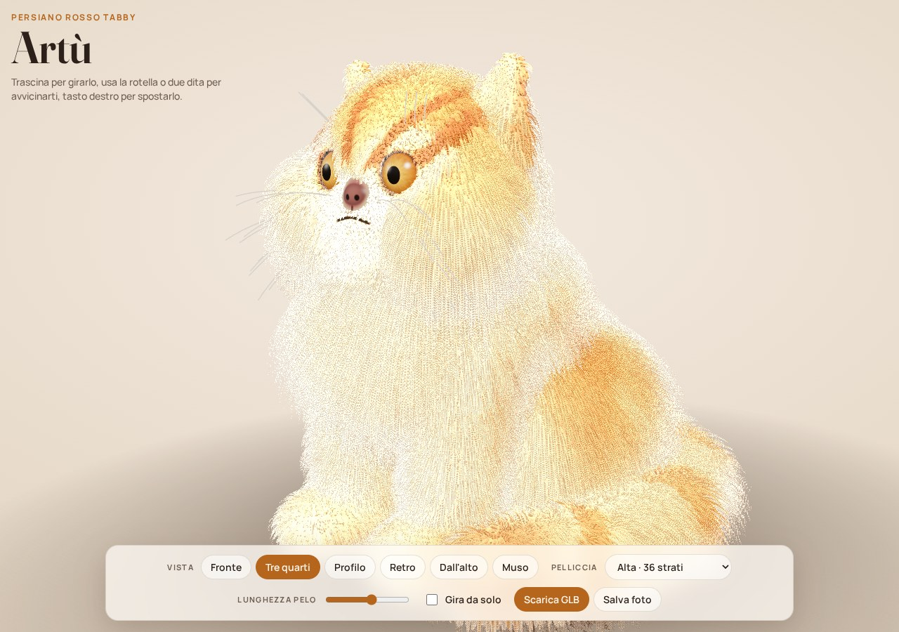
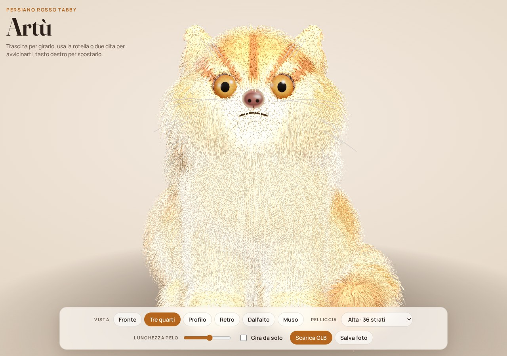
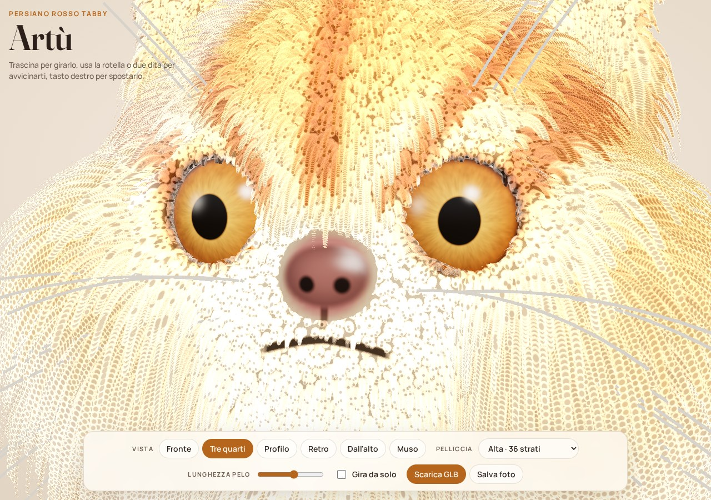
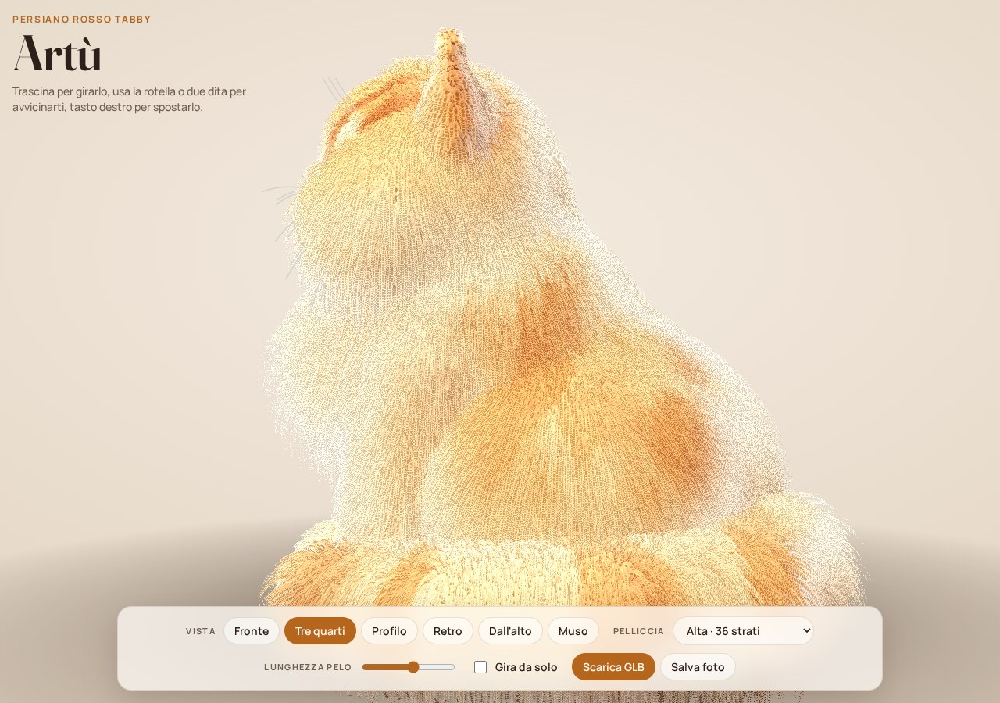
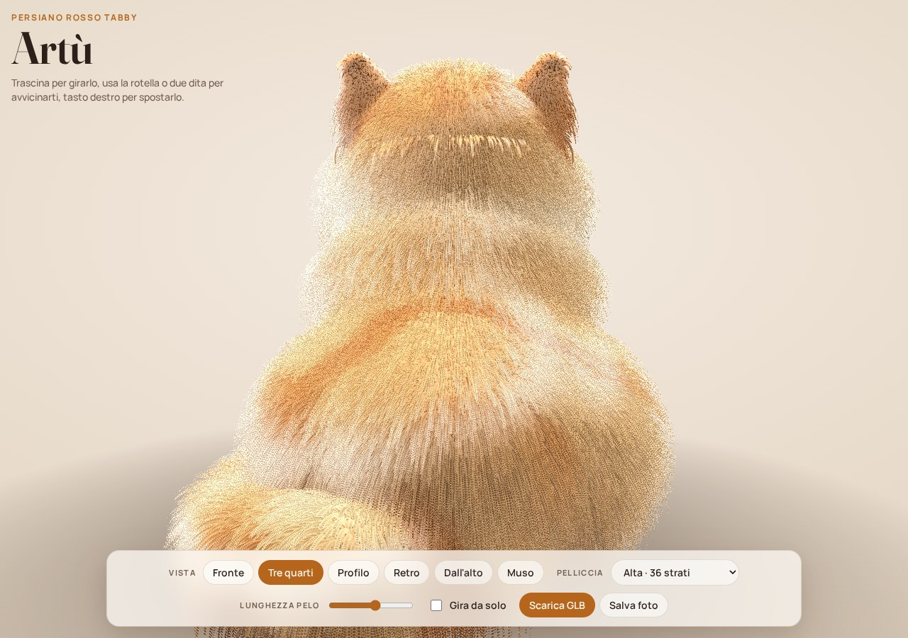
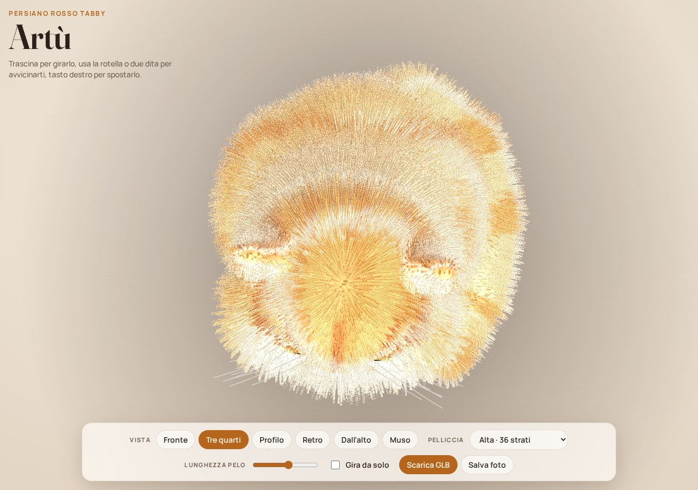

# Artù in 3D

Modello 3D di Artù, Persiano rosso tabby, ricostruito dalle sue foto: testa rotonda e muso piatto,
occhi grandi color rame con il bordo scuro, tartufo rosa-bruno alto fra gli occhi, orecchie piccole e
basse, "M" sulla fronte, collare e petto crema, corpo pesca con marcature tabby, coda a piumino con
anelli, baffi bianchi e la sua espressione seria con la bocca all'ingiù.

Si può ruotare, ingrandire e guardare da qualunque angolazione.



## Aprire il modello

- **`dist/index.html`**: il viewer completo in un unico file. Si apre con un doppio clic in qualsiasi
  browser moderno (Chrome, Edge, Firefox, Safari), anche senza connessione. Contiene già la geometria.
- **`export/artu-persiano.glb`**: il modello in formato glTF binario, apribile in Blender, nel
  Visualizzatore 3D di Windows, su iPhone/iPad (AR Quick Look tramite conversione) o in qualsiasi
  viewer glTF. Contiene la superficie con i colori del manto, gli occhi con texture e i baffi; la
  pelliccia a strati è un effetto del viewer e non fa parte del GLB.

### Comandi del viewer

| Azione | Mouse | Touch |
| --- | --- | --- |
| Ruotare | trascina con il tasto sinistro | un dito |
| Zoom | rotella | pizzica con due dita |
| Spostare | trascina con il tasto destro | due dita |

Nel pannello in basso: viste rapide (fronte, tre quarti, profilo, retro, dall'alto, muso), qualità
della pelliccia (numero di strati: da 12 a 56, più strati = più morbida ma più pesante), lunghezza
del pelo, rotazione automatica, download del GLB e salvataggio di una foto PNG.

## Come è fatto

Nessun servizio di ricostruzione automatica era disponibile in questo ambiente, quindi il modello è
costruito in modo procedurale a partire dalle proporzioni e dai colori osservati nelle foto:

1. **Anatomia** (`src/cat-shape.js`): il corpo seduto e la testa sono descritti come campi di
   distanza (sfere, ellissoidi, capsule fuse con unioni morbide), in centimetri. Orbite scavate con
   bordo palpebrale, tartufo, guance piene, mascella, orecchie con la conca, coda su una curva.
2. **Superficie** (`src/marching.js`): marching cubes con condivisione dei vertici e normali dal
   gradiente del campo. La testa è campionata a 1,3 mm, il corpo a 2,6 mm (circa 165 000 triangoli).
3. **Manto**: colore per vertice calcolato dal pattern tabby (dorso più caldo, strisce, chiazze sui
   fianchi, "M" sulla fronte, occhiali chiari, riga lacrimale, strisce sulle guance, anelli sulla
   coda, zone crema). Nello shader vengono aggiunti bordo degli occhi, tartufo con narici, filtro
   e linea della bocca.
4. **Pelliccia** (`src/fur-material.js`): tecnica *shell fur*. La maglia viene disegnata N volte
   spostata lungo la normale con gravità; ogni strato tiene solo i pixel dei ciuffi, con radici in
   ombra e riflesso anisotropo. La lunghezza del pelo è un attributo per vertice (collare 4,6 cm,
   corpo 3,2 cm, guance 3 cm, fronte 1 cm, palpebre 1,5 mm, tartufo nudo).
5. **Occhi** (`src/eye-material.js`): sfere con iride procedurale (fibre radiali, anello limbare
   scuro, pupilla rotonda), cornea lucida con riflessi.
6. **Baffi**: tubi lungo curve di Bézier, dai cuscinetti e sopra gli occhi.

## Rigenerare tutto

```bash
npm install
npm run gen     # geometria + GLB (Node, ~6 s)
npm run build   # dist/index.html e dist/artifact.html
npm run snap    # screenshot da sei angolazioni con Chromium headless
npm run serve   # http://127.0.0.1:8080/
```

Variabili utili: `HEAD_CELL` e `BODY_CELL` (dimensione delle celle in cm), `LAYERS`, `VIEWS`,
`W`/`H`, `EXPORT_GLB` per gli screenshot.

## Altre viste

| Fronte | Muso | Profilo |
| --- | --- | --- |
|  |  |  |

| Retro | Dall'alto |
| --- | --- |
|  |  |
